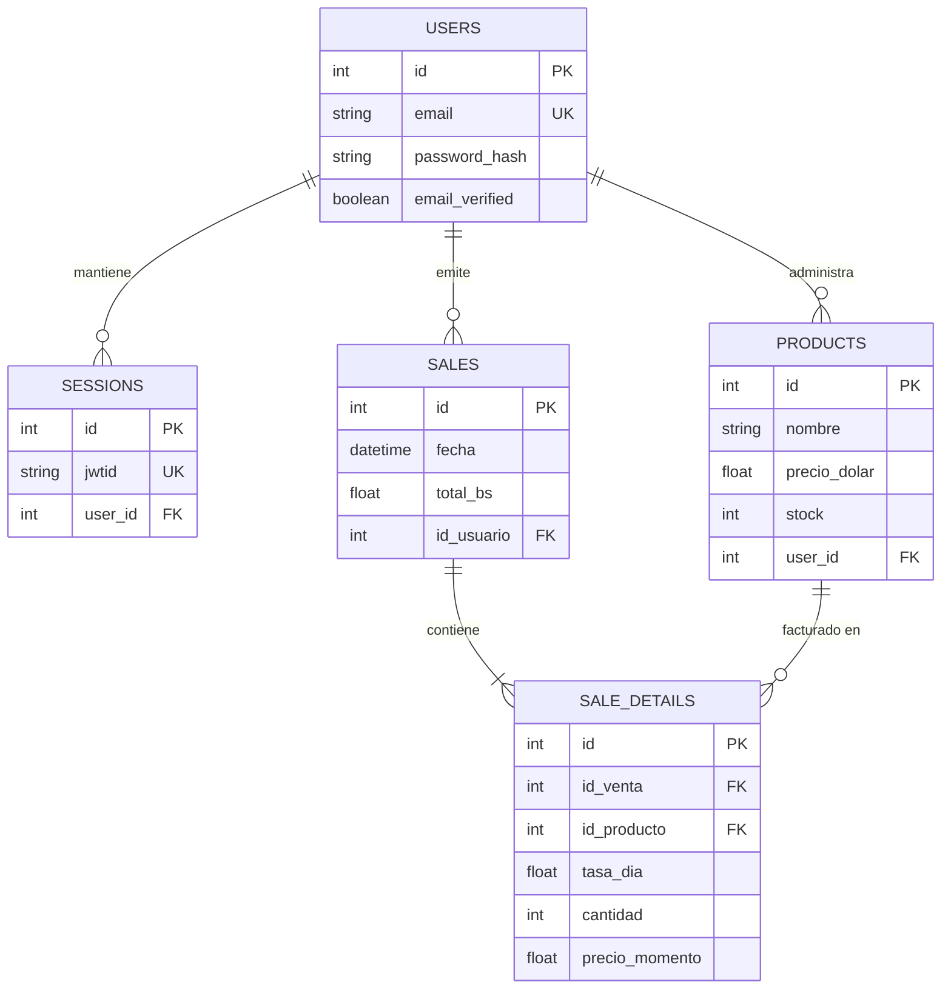
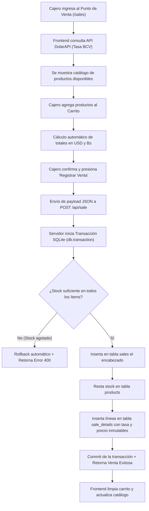
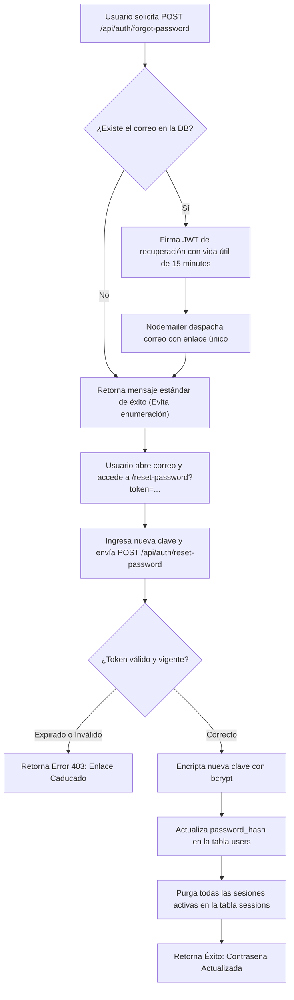
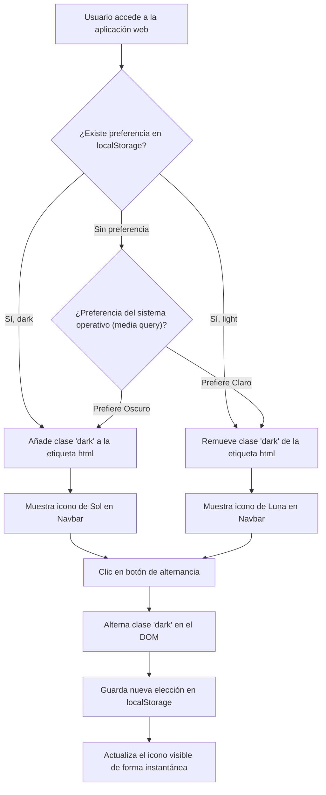

# 5. Diagramas y Estructura Organizativa

> **Tip:** Para visualizar estos diagramas de forma interactiva en VSCode, abre este archivo y presiona `Ctrl + Shift + V` (requiere la extensión **Markdown Preview Enhanced** o el soporte nativo de Markdown).

La representación gráfica de la arquitectura y los flujos de datos facilita enormemente el estudio y mantenimiento del sistema. A continuación, se presenta la radiografía visual de la plataforma.

## 1. Organización del Repositorio (Arquitectura Monorepo)

El proyecto adopta un enfoque modular basado en características (Feature-Driven Architecture), separando el servidor API del cliente web visual dentro de una estructura monorepo limpia:

```text
sistema-facturacion/
├── apps/
│   ├── api/                              (Servidor Backend - Puerto 3000)
│   │   ├── db/
│   │   │   ├── index.js                  # Inicialización y conexión SQLite (WAL)
│   │   │   └── tables.js                 # DDL de creación de tablas
│   │   ├── features/
│   │   │   ├── auth/                     # Controladores y rutas de autenticación
│   │   │   ├── product/                  # Gestión de inventario y stock
│   │   │   ├── sale/                     # Transacciones POS y registro de ventas
│   │   │   └── user/                     # Registro de nuevos comercios
│   │   ├── services/
│   │   │   └── nodemailer.js             # Integración de mensajería SMTP Gmail
│   │   ├── .env                          # Variables de entorno y secretos criptográficos
│   │   ├── index.js                      # Punto de entrada y middlewares globales
│   │   └── test.http                     # Batería de pruebas manuales REST Client
│   └── client/                           (Frontend Web - Puerto 4321)
│       └── src/
│           ├── components/               # Navbar, Spinners y Toasts de notificación
│           ├── features/                 # Lógica cliente (Auth, Inventario, Carrito)
│           ├── layout/                   # Layouts de página y guardias de ruta
│           ├── pages/                    # Vistas Astro (Dashboard, POS, Historial)
│           └── styles/
│               └── global.css            # Configuración Tailwind v4 y Dark Mode
└── documentacion/                        # Base documental técnica para estudio
```

---

## 2. Diagrama de la Base de Datos (Relaciones y Multi-tenancy)

El modelo relacional garantiza el aislamiento por comercio (cada usuario es un "tenant") y la integridad transaccional en las ventas:



---

## 3. Flujo de Punto de Venta (POS) e Integración BCV

El proceso de venta involucra consultas externas, cálculos bimonetarios al vuelo y transaccionalidad estricta en el servidor:



---

## 4. Flujo de Recuperación de Contraseña

Secuencia blindada para la restauración de acceso sin comprometer la seguridad de las cuentas:



---

## 5. Sistema de Temas (Dark Mode Toggle)

Funcionamiento del cambio de apariencia con persistencia en el cliente:


